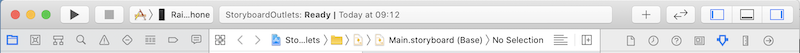
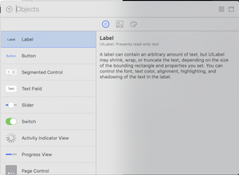
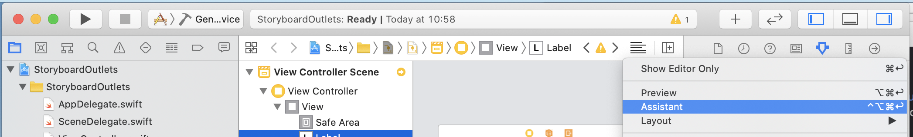
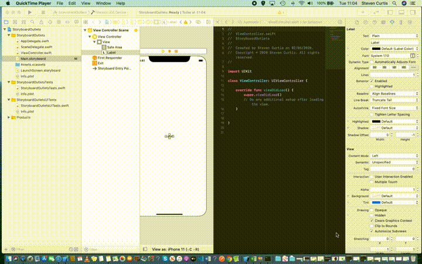
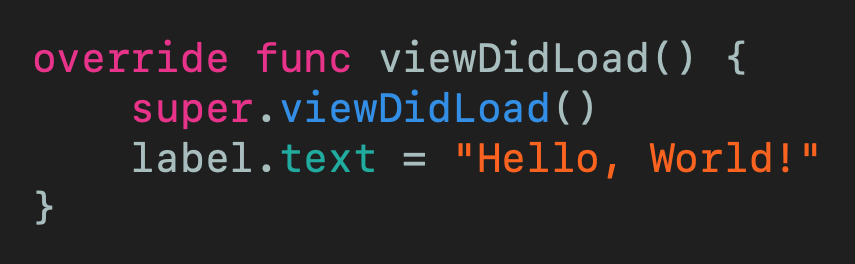
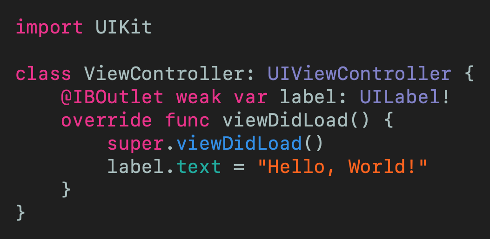

# Connect Storyboard Objects to Code
## If you're using the Storyboard, you need to know this

 
Photo by Joshua Ness on Unsplash

The idea of this tutorial is to add objects to the storyboard and be able to update them programatically in the `UIViewController`. Possible? Sure. How? This article!

Difficulty: **Beginner** | Easy | Normal | Challenging
This article has been developed using Xcode 11.4.1, and Swift 5.2.2

## Prerequisites: 
* You will be expected to be aware how to make a [Single View Application](https://medium.com/swlh/your-first-ios-application-using-xcode-9983cf6efb71) in Swift.

# The step-by-step, adding a UILabel to the Storyboard
## Create a new Single View Project
This is covered in my  [Single View Application](https://medium.com/swlh/your-first-ios-application-using-xcode-9983cf6efb71) article, but pretty much all this means is that you need to open up Xcode and New>Single View Project. I named mine `StoryboardOutlets`.

## Add a UILabel to the Storyboard
Select the `Main.storyboard` file from the project inspector on the left-hand side. The  `UIViewController` appears, and allows us to use the + symbol to be able to add objects

which can then be added by choosing  `UILabel`  
 
and a simple drag-drop operation will help us out here. 
 
 
Now by dragging and dropping the `UILabel` and matching the blue lines when we drop it onto the centre of the `UIViewController` it will match to the centre - exactly what we would want!

## Connect the UILabel to the Swift file
The `UILabel` needs to be connected to the `ViewController.swift` file (assuming that you have left the `UIViewController` called *ViewController*). We are going to name this `UILabel` instance as *label* (creativity is everything, right?).
### Loading the Assistant editor
With the Storyboard still selected, we can select the following jump bar icon: 
 
which when placed on the jump bar is towards the right of the screen

As shown, select *Assistant*. 
The following part is actually quite easy / tricky depending on how you see it. We need to control-drag from the `UILabel` to the `ViewController.swift` file. 

as you see, I've then named the outlet as **label**

## Access the UILabel from the view controller
The `UILabel` can then be accessed from the view controller as normal. That is, we just set `label.text = "Hello, World!"` as I've done in the `viewDidLoad()` function. 

which leaves us with the following view controller code.

# Conclusion
If you've any questions, comments or suggestions please hit me up on [Twitter](https://twitter.com/stevenpcurtis) 
